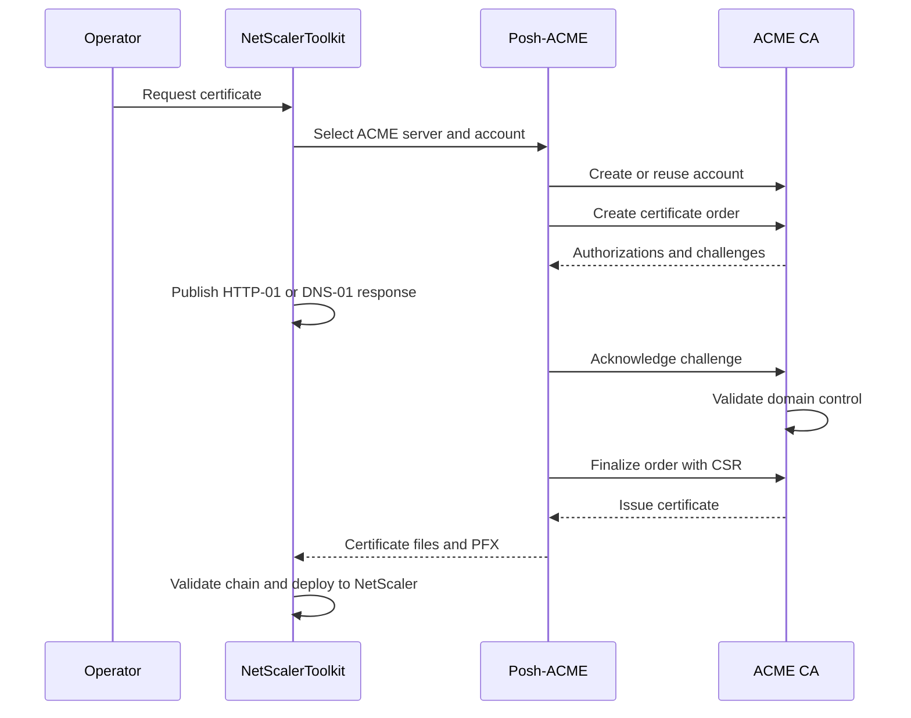
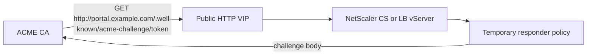
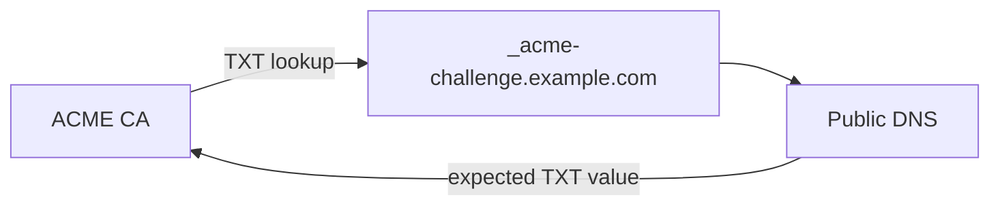
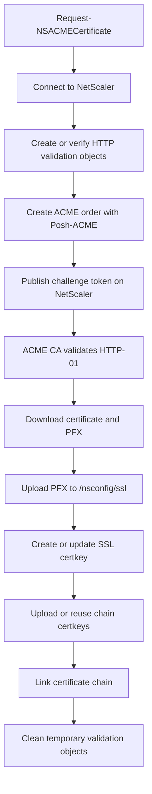
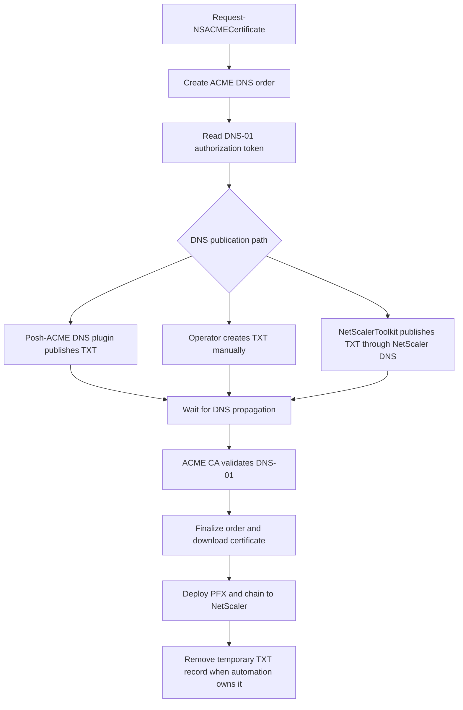
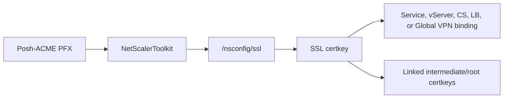

# ACME How It Works

ACME is the protocol used by Let's Encrypt and other ACME certificate authorities to automate certificate issuance. An ACME client creates or reuses an account, starts an order for one or more domain names, proves control of those names with challenges, finalizes the order with a CSR, and downloads the issued certificate.

NetScalerToolkit uses Posh-ACME for the ACME protocol work and then uses NetScaler NITRO calls to deploy the certificate to NetScaler.

## ACME Issuance Flow

The important part is domain control validation. The CA does not issue the certificate because the requester knows a password or has access to a NetScaler. It issues the certificate after it can verify that the requester controls each requested domain name.

## HTTP-01

HTTP-01 proves domain control by publishing a challenge response at a well-known HTTP path for the requested hostname. The ACME CA connects to the public hostname over HTTP and checks that the expected token response is available.

Use HTTP-01 when the public HTTP path reaches a NetScaler VIP and the certificate does not require a wildcard name. NetScalerToolkit can create the temporary NetScaler responder objects needed to answer the challenge and remove them after validation.

## DNS-01

DNS-01 proves domain control by publishing a TXT record under `_acme-challenge`. The ACME CA queries public DNS and checks that the expected TXT value is present.

Use DNS-01 when HTTP-01 cannot reach the NetScaler VIP, when the certificate includes a wildcard name, or when DNS validation is the operational preference. NetScalerToolkit supports three DNS-01 paths:

- Posh-ACME DNS plugin: Posh-ACME calls the DNS provider plugin.
- Manual DNS: the operator creates and removes TXT records manually.
- NetScaler DNS: NetScalerToolkit publishes TXT records through NetScaler DNS when NetScaler is authoritative, delegated, or otherwise publicly resolvable for the validation name.

DNS propagation matters. If public resolvers still return old `_acme-challenge` TXT values, validation can fail with an incorrect TXT record error.

## NetScaler HTTP-01 Implementation

The current NetScalerToolkit HTTP-01 flow is based on the same idea as the original GenLeCertForNS workflow: let NetScaler answer the ACME HTTP challenge without changing the backend application. The implementation now runs through `Request-NSACMECertificate`, Posh-ACME, generated NetScaler NITRO functions, structured logging, renewal decisions, and certificate chain deployment.

For content switching, NetScalerToolkit can bind a temporary policy that matches `/.well-known/acme-challenge/` and routes the request to the validation response. For an existing LB VIP workflow, the temporary responder objects are attached to the LB path instead of a CS VIP.

## DNS-01 Implementation

DNS-01 can publish the TXT record through a Posh-ACME DNS provider plugin, through manual operator steps, or through NetScaler DNS when `UseNetScalerDNS` is enabled.
When NetScaler DNS is used, NetScaler must be authoritative, delegated, or otherwise publicly resolvable for the validation name.

## Deployment After Issuance

After HTTP-01 or DNS-01 succeeds, deployment is the same:

1. Select the certificate artifacts returned by Posh-ACME.
2. Validate and log the selected certificate chain.
3. Upload the PFX to `/nsconfig/ssl/`.
4. Create or update the NetScaler SSL certkey.
5. Upload or reuse CA chain certkeys.
6. Link the leaf certkey to the intermediate and root chain certkeys.
7. Optionally update Global VPN, IIS, cleanup, or post-run actions.

## Sources

- [RFC 8555: Automatic Certificate Management Environment](https://datatracker.ietf.org/doc/html/rfc8555)
- [Let's Encrypt: How It Works](https://letsencrypt.org/how-it-works/)
- [Let's Encrypt: Challenge Types](https://letsencrypt.org/docs/challenge-types/)
- [Material for MkDocs: Diagrams](https://squidfunk.github.io/mkdocs-material/reference/diagrams/)
- [Original GenLeCertForNS article: Let's Encrypt Certificates on a NetScaler](https://blog.j81.nl/2017/04/06/lets-encrypt-certificates-on-a-netscaler/)
