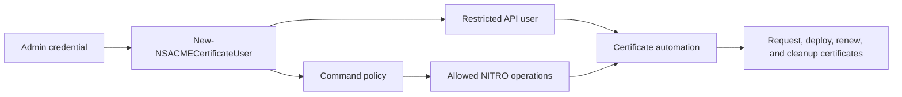

# API User Bootstrap

`New-NSACMECertificateUser` creates or updates command policies and an optional API user for certificate automation.



## Example

```powershell
$adminCredential = [pscredential]::new(
    'nsroot',
    (ConvertTo-SecureString 'Sup3rS3cretP@ssw0rd' -AsPlainText -Force)
)

$apiPassword = ConvertTo-SecureString 'L34s3r!' -AsPlainText -Force

$userParams = @{
    ManagementURL               = 'https://ns-01.domain.local'
    Credential                  = $adminCredential
    SkipCertificateCheck        = $true
    CreateUserPermissions       = $true
    CreateApiUser               = $true
    ApiUsername                 = 'leuser'
    ApiPassword                 = $apiPassword
    UseNetScalerDNS             = $true
    UpdateGlobalVPNCertBinding  = $true
    SaveADCConfig               = $true
    PassThru                    = $true
}

New-NSACMECertificateUser @userParams
```

## Usage Pattern

1. Bootstrap permissions with an administrative account.
2. Store the restricted API user credential in your automation secret store.
3. Run regular certificate automation as the restricted user.
4. Review generated policies when adding new certificate scenarios.

## WhatIf

Use `-WhatIf` before applying changes:

```powershell
New-NSACMECertificateUser ... -WhatIf
```
