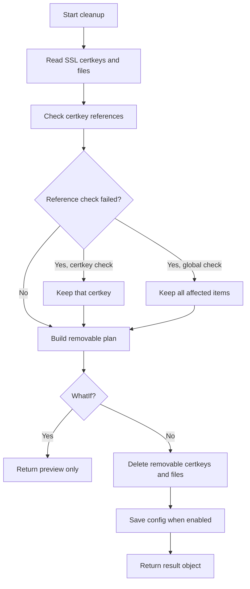

# Cleanup

Use cleanup commands when a certificate workflow stops before temporary objects are removed, when test certificates should be removed from NetScaler, or when unused SSL certkey files should be cleaned from `/nsconfig/ssl`.

## Clean Unused NetScaler CertKey Files

`Invoke-NSCleanCertKeyFiles` scans NetScaler SSL certkeys and certificate files before removing anything. A certkey or file is skipped when it is detected in SSL bindings, linked certificates, SAML actions, Global VPN bindings, SSL DH file settings, or the running configuration.



Use `-WhatIf` to review the cleanup plan without deleting objects:

```powershell
$cleanupParams = @{
    ManagementUrl        = 'https://ns-01.domain.local'
    Credential           = $credential
    SkipCertificateCheck = $true
    Backup               = $true
}

Invoke-NSCleanCertKeyFiles @cleanupParams -WhatIf
```

Add `-Verbose` when you need to see each NetScaler API step. Verbose output includes the active scan phase, certkey being checked, file path being checked or deleted, node label, and the NITRO method/URI when the transport layer fails before NetScaler returns a response.

If an individual certkey binding reference check fails, that certkey is kept and marked as non-removable for the current run. Cleanup continues for other certkeys and files that can still be validated safely.
If a global certkey reference check fails, all certkeys are kept for that run. If a global file reference check fails, files are kept for that run.
Default NetScaler SSL support files are excluded with `ExcludeFile` and `ExcludeFilePattern`, including `ns-root.*`, `ns-server.*`, `ns-sftrust*`, certificate hash-link files, and common root bundle files.

Run the cleanup when the preview matches the intended changes:

```powershell
Invoke-NSCleanCertKeyFiles @cleanupParams
```

When you already have a NetScaler session, pass it directly:

```powershell
$session = Connect-NSNode `
    -ManagementUrl 'https://ns-01.domain.local' `
    -Credential $credential `
    -SkipCertificateCheck `
    -HA `
    -PassThru

$cleanupParams = @{
    Session      = $session
    Backup       = $true
    NoSaveConfig = $false
    PassThru     = $true
}

$cleanupPlan = Invoke-NSCleanCertKeyFiles @cleanupParams
```

Use `-Summary` to print a short end-of-run summary to the console while still assigning the cleanup result object:

```powershell
$cleanupPlan = Invoke-NSCleanCertKeyFiles @cleanupParams -Summary
```

The console summary includes initial and final certkey/file totals, removed certkey count, removed file count, remaining removable items, and whether cleanup changed and saved the NetScaler configuration. The returned cleanup result includes `CertKeys`, `Files`, `RemovedCertKeys`, and `RemovedFiles`.

See the [command reference](../module/reference/common/cert-key-files/clean.md) for all parameters.

## Clean HTTP Validation Objects

`CleanADC` removes the NetScaler objects created for HTTP-01 validation. Use the same object names that were used during the failed or interrupted run.

```powershell
$cleanupParams = @{
    CleanADC              = $true
    ManagementURL         = 'https://ns-01.domain.local'
    Credential            = $credential
    SkipCertificateCheck  = $true
    CsVipName             = 'cs_example_http'
    CspName               = 'csp_letsencrypt'
    CsaName               = 'csa_letsencrypt'
    LbName                = 'lb_letsencrypt_cert'
    SvcName               = 'svc_letsencrypt_cert_dummy'
    RspName               = 'rsp_letsencrypt'
    RsaName               = 'rsa_letsencrypt'
}

Request-NSACMECertificate @cleanupParams
```

## Remove Test Certificates

`RemoveTestCertificates` removes Let's Encrypt staging certificates from NetScaler.

```powershell
$cleanupParams = @{
    RemoveTestCertificates = $true
    ManagementURL          = 'https://ns-01.domain.local'
    Credential             = $credential
    SkipCertificateCheck   = $true
}

Request-NSACMECertificate @cleanupParams
```

## Clean Posh-ACME Storage

Use `CleanPoshACMEStorage` with the cleanup command when the local Posh-ACME storage should also be cleaned.
This is useful when local ACME account/order state should be reset before a new request.
`CleanVault` is accepted as a legacy alias.

```powershell
$cleanupParams.CleanPoshACMEStorage = $true
Request-NSACMECertificate @cleanupParams
```
