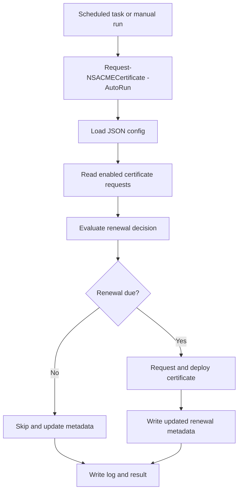

# Config File And AutoRun

Use a JSON config file when scheduled tasks should renew one or more certificates without putting every parameter on the command line.



## Create Or Update A Config File

Add `ConfigFile` to a normal request. The command runs the request and writes the reusable config file.
Review generated values before using the file for unattended renewals.

```powershell
$requestParams = @{
    ManagementURL        = 'https://ns-01.domain.local'
    Credential           = $credential
    SkipCertificateCheck = $true
    CN                   = 'example.com'
    SAN                  = @('portal.example.com', 'www.example.com')
    ValidationMethod     = 'http'
    CsVipName            = 'cs_example_http'
    CertKeyNameToUpdate  = 'san_example_com'
    CertDir              = 'C:\Certificates\Example'
    EmailAddress         = 'hostmaster@example.com'
    ConfigFile           = '.\GenLe-Config.json'
}

Request-NSACMECertificate @requestParams
```

The generated file uses the same top-level layout shown below: shared values under `settings`, and one or more request entries under `certrequests`.

## Scheduled Renewal

Use `AutoRun` with the same config file for scheduled execution.

```powershell
$autorunParams = @{
    ConfigFile = '.\GenLe-Config.json'
    AutoRun    = $true
}

Request-NSACMECertificate @autorunParams
```

Add `Production = $true` to request production certificates from the same config.

Scheduled runs skip certificates that are still valid and outside their renewal window. The module prefers ACME provider renewal metadata through Posh-ACME, then falls back to the existing certificate lifetime when needed. The generated JSON can include `CertExpires`, `RenewAfter`, `RenewalSource`, `RenewalStrategy`, `AcmeProvider`, `AcmeServer`, and `AcmeRenewalInfoSupported` for visibility. Use `LogLevel = "Debug"` when the scheduled log should include the full renewal decision.

## Multiple Certificate Requests

The config file can contain multiple entries in `certrequests`. Each entry represents one certificate request, while shared settings such as `ManagementURL`, validation object names, logging, and mail settings live under `settings`.

```json
{
  "settings": {
    "ManagementURL": "https://ns-01.domain.local",
    "LogLevel": "Info",
    "SvcName": "svc_letsencrypt_cert_dummy",
    "LbName": "lb_letsencrypt_cert",
    "RspName": "rsp_letsencrypt",
    "RsaName": "rsa_letsencrypt",
    "CspName": "csp_letsencrypt"
  },
  "certrequests": [
    {
      "CN": "example.com",
      "SANs": "portal.example.com,www.example.com",
      "ValidationMethod": "http",
      "CsVipName": "cs_example_http",
      "CertKeyNameToUpdate": "san_example_com",
      "CertDir": "C:\\Certificates\\Example",
      "EmailAddress": "hostmaster@example.com"
    },
    {
      "CN": "vpn.example.com",
      "ValidationMethod": "http",
      "CsVipName": "cs_vpn_http",
      "CertKeyNameToUpdate": "vpn.example.com",
      "CertDir": "C:\\Certificates\\Example",
      "EmailAddress": "hostmaster@example.com"
    }
  ]
}
```
