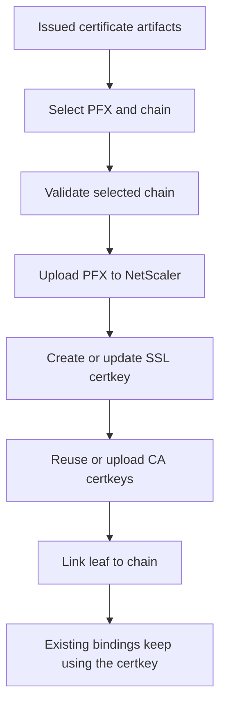

# Certificate Deployment

Use certificate deployment when you want NetScalerToolkit to create or update the NetScaler SSL certkey after certificate issuance.

After ACME issuance, NetScalerToolkit deploys the certificate to NetScaler as a PFX-backed SSL certkey.



## Create A New Certkey

Omit `-CertKeyNameToUpdate`:

```powershell
$requestParams = @{
    ManagementURL        = 'https://ns-01.domain.local'
    Credential           = $credential
    SkipCertificateCheck = $true
    CN                   = 'portal.example.com'
    ValidationMethod     = 'http'
    CsVipName            = 'cs_portal_http'
    CertDir              = 'C:\Certificates\Example'
    EmailAddress         = 'hostmaster@example.com'
}

Request-NSACMECertificate @requestParams
```

## Update An Existing Certkey

Set `-CertKeyNameToUpdate`:

```powershell
$requestParams.CertKeyNameToUpdate = 'portal.example.com'
Request-NSACMECertificate @requestParams
```

## Chain Handling

The deployment path reuses matching CA certkeys when possible, uploads missing CA certificates, and links the leaf certkey to the chain.

Before deployment, NetScalerToolkit logs the selected certificate artifacts and chain certificate details. By default, it validates the selected chain and writes a warning when Windows/.NET chain validation reports a problem, including revocation or revocation-check failures.

Use `-CertificateChainValidation` to control this guardrail:

```powershell
$requestParams.CertificateChainValidation = 'Warn' # None, Warn, or Fail
Request-NSACMECertificate @requestParams
```

Use `Fail` when deployment must stop if the selected chain cannot be validated. Use `None` only when chain validation is handled outside the module.

## Uploaded PFX Cleanup

Use `-RemoveUploadedPfx` when the PFX file should be deleted from `/nsconfig/ssl/` after the certkey has been created or updated:

```powershell
Request-NSACMECertificate ... -RemoveUploadedPfx
```
